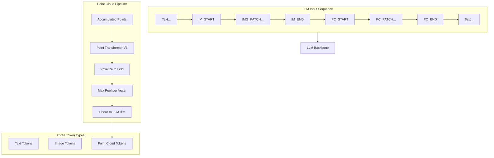

# Molmo Point Cloud Extension

## Current Architecture

The robot training uses:
- **Model**: `MolmoConfig` / `Molmo` (from [`olmo/models/molmo/molmo.py`](olmo/models/molmo/molmo.py))
- **Training script**: [`launch_scripts/train_multitask_model.py`](launch_scripts/train_multitask_model.py)
- **Dataset**: `RobotDataset` (from [`olmo/data/robot_datasets.py`](olmo/data/robot_datasets.py))
- **Mixtures**: `robot-multitask`, `robot-only`

## Proposed Architecture



## Implementation Steps

### Step 1: Create 3D_Reasoning Branch
```bash
git checkout -b 3D_Reasoning
```

### Step 2: Add Point Cloud Special Tokens

**File**: [`olmo/tokenizer.py`](olmo/tokenizer.py)

```python
POINT_CLOUD_START_TOKEN = "<|point_start|>"
POINT_CLOUD_PATCH_TOKEN = "<|point_patch|>"  
POINT_CLOUD_END_TOKEN = "<|point_end|>"
```

### Step 3: Create Point Cloud Backbone

**File**: `olmo/nn/point_cloud_backbone.py`

```python
@dataclass
class PointCloudBackboneConfig:
    voxel_size: float = 0.1        # Meters per voxel
    grid_range: float = 10.0       # [-R, R] meters  
    ptv3_dim: int = 512            # PTv3 output dim

class PointCloudBackbone(nn.Module):
    def __init__(self, config, llm_dim):
        self.ptv3 = load_ptv3_model()  # From pointcept
        self.projector = nn.Linear(config.ptv3_dim, llm_dim)
    
    def forward(self, points, masks):
        # 1. PTv3 encode: points -> per-point features
        # 2. Voxelize into spatial patches  
        # 3. Max pool per voxel
        # 4. Linear project to LLM dim
        return patch_tokens  # [B, num_patches, llm_dim]
```

### Step 4: Extend Molmo Model

**File**: [`olmo/models/molmo/molmo.py`](olmo/models/molmo/molmo.py)

Add to `MolmoConfig`:
```python
point_cloud_backbone: Optional[PointCloudBackboneConfig] = None
```

Add to `Molmo.__init__`:
```python
if config.point_cloud_backbone is not None:
    self.point_cloud_backbone = config.point_cloud_backbone.build(config.llm, device)
self._point_patch_id = self.special_ids[tokenizer.POINT_CLOUD_PATCH_TOKEN]
```

Add to `Molmo.forward`:
```python
if point_clouds is not None:
    point_features = self.point_cloud_backbone(point_clouds, point_masks)
    is_point_patch = input_ids.view(-1) == self._point_patch_id
    x.view(-1, x.shape[-1])[is_point_patch] += point_features
```

### Step 5: Update Preprocessor

**File**: [`olmo/models/molmo/model_preprocessor.py`](olmo/models/molmo/model_preprocessor.py)

- Add point cloud token generation
- Insert `PC_START`, `PC_PATCH...`, `PC_END` into sequence
- Track `point_input_idx` for position mapping

### Step 6: Update Collator

**File**: [`olmo/models/molmo/collator.py`](olmo/models/molmo/collator.py)

- Collate point cloud data in batches
- Handle variable number of point patches

### Step 7: Update RobotDataset

**File**: [`olmo/data/robot_datasets.py`](olmo/data/robot_datasets.py)

- Load precomputed point cloud data from HDF5
- Include camera extrinsics for trajectory aggregation
- Add to example dict: `point_cloud`, `point_mask`

### Step 8: VGGT Preprocessing Script

**File**: `scripts/precompute_vggt_depth.py`

- Run VGGT on RGB frames -> depth + extrinsics
- Convert depth to point clouds
- Aggregate over trajectory
- Save to HDF5

## File Changes Summary

| File | Action |
|------|--------|
| `olmo/tokenizer.py` | Add PC tokens |
| `olmo/nn/point_cloud_backbone.py` | Create |
| `olmo/models/molmo/molmo.py` | Extend for point clouds |
| `olmo/models/molmo/model_preprocessor.py` | Add PC token generation |
| `olmo/models/molmo/collator.py` | Collate PC data |
| `olmo/data/robot_datasets.py` | Load PC data |
| `scripts/precompute_vggt_depth.py` | Create |
| `pyproject.toml` | Add pointcept dep |