# Point Cloud Integration for Robot Navigation Training

## Architecture Overview

```mermaid
flowchart TB
    subgraph DataPrep [Offline Data Preprocessing]
        RGB[RGB Frames] --> VGGT[VGGT Model]
        VGGT --> Depth[Depth Maps]
        VGGT --> Extrinsics[Camera Extrinsics]
        Depth --> PointMap[Point Maps]
    end

    subgraph Runtime [Training Runtime]
        subgraph ImageBranch [Image Branch - Existing]
            Frames[Video Frames] --> VisionBackbone[Vision Backbone]
            VisionBackbone --> ImageFeatures[Image Features]
        end

        subgraph PointBranch [Point Cloud Branch - New]
            PointData[Precomputed Point Maps] --> Aggregator[Trajectory Aggregator]
            Aggregator --> WorldPoints[World-Frame Points]
            WorldPoints --> PTv3[Point Transformer V3]
            PTv3 --> PointFeatures[Point Features]
            PointFeatures --> BEVRasterizer[BEV Rasterizer]
            BEVRasterizer --> BEVGrid[BEV Feature Grid]
            BEVGrid --> SpatialPatcher[Spatial Patcher]
            SpatialPatcher --> PatchTokens[Patch Tokens + RoPE]
        end

        ImageFeatures --> Fusion[Feature Fusion]
        PatchTokens --> Fusion
        Fusion --> LLM[LLM Backbone]
    end
```



## Implementation Steps

### 1. Data Preprocessing Script (VGGT Depth Estimation)

Create a new script to pre-compute depth maps and point clouds from RGB frames:

- **File**: `scripts/precompute_vggt_depth.py`
- Uses VGGT to estimate depth and camera extrinsics from RGB frames
- Stores depth maps and point maps in HDF5 alongside existing data
- Converts depth maps to 3D point maps using `unproject_depth_map_to_point_map`

### 2. Point Cloud Processing Module

Create new modules in `olmo/nn/`:

- **File**: `olmo/nn/point_cloud_backbone.py`
  - `PointCloudBackboneConfig`: Configuration dataclass
  - `TrajectoryPointAggregator`: Accumulates points across timesteps, transforms to world frame using extrinsics
  - `BEVRasterizer`: Projects points onto 2D grid, aggregates features per cell (max/mean pooling)
  - `SpatialPatcher`: Divides BEV grid into patches, creates patch tokens
  - `PointCloudBackbone`: Main module wrapping PTv3 + rasterization

### 3. Point Transformer V3 Integration

- Install PTv3 from external package: `pointcept` library (PTv3 reference implementation)
- **File**: `olmo/nn/point_transformer.py`
  - Wrapper class adapting PTv3 interface to our codebase
  - Handle batch processing of variable-size point clouds
  - Extract per-point features from PTv3 output

### 4. BEV Grid and RoPE Positional Embeddings

In `olmo/nn/point_cloud_backbone.py`:

```python
# BEV Grid Configuration
- Grid range: [-R, R] meters in x, y (configurable, e.g., R=10m)
- Resolution: r meters per cell (e.g., r=0.1m)
- Grid size: H x W = (2R/r) x (2R/r) cells
- Feature dimension: C (from PTv3 output)

# Spatial Patching
- Patch size: 4x4 cells
- Pool features within each patch
- Apply 2D RoPE based on patch center coordinates
```

### 5. New Robot Model Architecture

Create a new model extending VideoOlmo:

- **File**: `olmo/models/robot_olmo/robot_olmo.py`
  - `RobotOlmoConfig`: Extends VideoOlmo config with point cloud settings
  - `RobotOlmo`: New model class
  - Parallel vision + point cloud backbones
  - Feature fusion layer (concatenation + projection, or cross-attention)
  - Modified forward pass to handle both modalities

### 6. Dataset Updates

Modify [`olmo/data/robot_datasets.py`](olmo/data/robot_datasets.py):

- Add loading of precomputed point maps/depth data
- Include camera extrinsics in example dict
- Collate point cloud data for batching

### 7. Preprocessor Updates

Create `olmo/models/robot_olmo/robot_preprocessor.py`:

- Handle point cloud preprocessing alongside video frames
- Manage trajectory-level point aggregation
- Prepare BEV grid inputs

## Key Design Decisions

| Decision | Choice | Rationale |
|----------|--------|-----------|
| Depth source | VGGT precomputed | Training speed, avoid GPU memory for depth model |
| PTv3 source | `pointcept` package | Well-tested, optimized implementation |
| Fusion method | Parallel + late fusion | Preserves both modalities' strengths |
| BEV representation | 2D egocentric grid | Natural for navigation, efficient for CNNs/transformers |
| Positional encoding | 2D RoPE | Captures relative spatial relationships |

## File Changes Summary

| File | Action |
|------|--------|
| `scripts/precompute_vggt_depth.py` | Create |
| `olmo/nn/point_cloud_backbone.py` | Create |
| `olmo/nn/point_transformer.py` | Create |
| `olmo/models/robot_olmo/__init__.py` | Create |
| `olmo/models/robot_olmo/robot_olmo.py` | Create |
| `olmo/models/robot_olmo/robot_preprocessor.py` | Create |
| `olmo/models/robot_olmo/robot_collator.py` | Create |
| `olmo/data/robot_datasets.py` | Modify |
| `olmo/models/model_config.py` | Modify |
| `requirements.txt` or `pyproject.toml` | Modify (add pointcept) |
