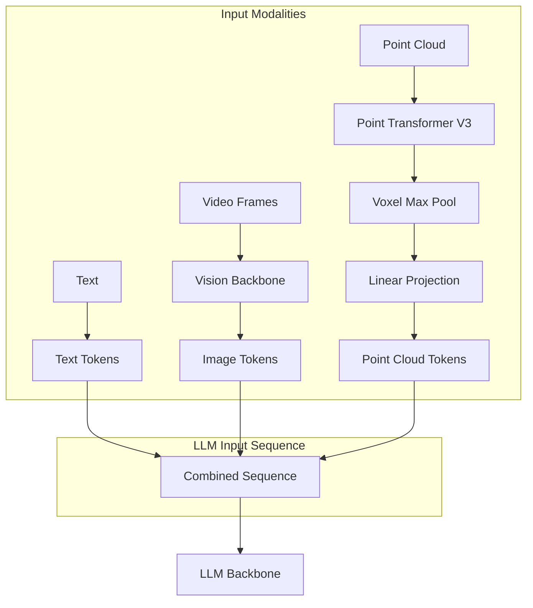

# Point Cloud Tokens Integration

## Architecture Overview




## Token Sequence Structure

```javascript
[TEXT] ... [IM_START] [IMG_PATCH] ... [IM_END] [PC_START] [PC_PATCH] ... [PC_END] [TEXT] ...
```

Three distinct token types:

- **Text tokens**: Regular vocabulary tokens
- **Image tokens**: `IM_START`, `IMAGE_PATCH`, `IM_END` (existing)
- **Point cloud tokens**: `PC_START`, `POINT_PATCH`, `PC_END` (new)

## Implementation Steps

### Step 1: Create Branch

```bash
git checkout -b 3D_Reasoning
```


### Step 2: Add Point Cloud Special Tokens

**File**: [`olmo/tokenizer.py`](olmo/tokenizer.py)Add new special tokens:

```python
POINT_CLOUD_START_TOKEN = "<|point_start|>"
POINT_CLOUD_PATCH_TOKEN = "<|point_patch|>"
POINT_CLOUD_END_TOKEN = "<|point_end|>"
```


### Step 3: Create Point Cloud Backbone

**File**: `olmo/nn/point_cloud_backbone.py`

```python
@dataclass
class PointCloudBackboneConfig:
    voxel_size: float = 0.1        # Meters per voxel
    grid_range: float = 10.0       # [-R, R] meters
    ptv3_dim: int = 512            # PTv3 output dim

class PointCloudBackbone(nn.Module):
    def __init__(self, config, llm_dim):
        self.ptv3 = load_ptv3()    # From pointcept
        self.projector = nn.Linear(config.ptv3_dim, llm_dim)
    
    def forward(self, points, masks):
        # 1. PTv3: points -> per-point features
        # 2. Voxelize into spatial patches
        # 3. Max pool per voxel
        # 4. Linear project to LLM dim
        # Returns: [B, num_patches, llm_dim]
```


### Step 4: Extend VideoOlmo

**File**: [`olmo/models/video_olmo/video_olmo.py`](olmo/models/video_olmo/video_olmo.py)Add point cloud processing to forward pass:

```python
# In forward():
if point_clouds is not None:
    point_features = self.point_cloud_backbone(point_clouds, point_masks)
    # Insert at positions marked by POINT_PATCH tokens
    is_point_patch = input_ids == self._point_patch_id
    x.view(-1, x.shape[-1])[is_point_patch] += point_features
```


### Step 5: Update Preprocessor

**File**: `olmo/models/video_olmo/video_preprocessor.py`

- Generate point cloud tokens in sequence
- Track point cloud positions with `point_input_idx`
- Handle point cloud masks

### Step 6: Update Dataset

**File**: [`olmo/data/robot_datasets.py`](olmo/data/robot_datasets.py)

- Load precomputed point cloud data
- Include in example dict: `point_cloud`, `point_mask`, `camera_extrinsics`

### Step 7: VGGT Preprocessing Script

**File**: `scripts/precompute_vggt_depth.py`

- Run VGGT on RGB frames
- Convert depth maps to point clouds
- Aggregate over trajectory using extrinsics
- Save to HDF5

## File Changes Summary

| File | Action | Description ||------|--------|-------------|| `olmo/tokenizer.py` | Modify | Add PC_START, PC_PATCH, PC_END tokens || `olmo/nn/point_cloud_backbone.py` | Create | PTv3 + voxel pool + linear || `olmo/models/video_olmo/video_olmo.py` | Modify | Add point cloud backbone, handle PC tokens || `olmo/models/video_olmo/video_preprocessor.py` | Modify | Generate point cloud token sequences || `olmo/data/robot_datasets.py` | Modify | Load point cloud data || `scripts/precompute_vggt_depth.py` | Create | VGGT depth preprocessing || `pyproject.toml` | Modify | Add pointcept dependency |