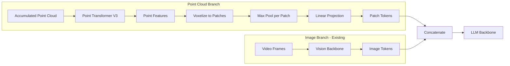

# Simplified Point Cloud Integration

## Architecture Overview




## Simplified Approach

1. **Point Transformer V3**: Use external `pointcept` package to encode aggregated point cloud
2. **Voxelization**: Divide 3D space into patches/voxels
3. **Max Pooling**: Pool point features within each voxel
4. **Linear Projection**: Project pooled features to LLM dimension
5. **Fusion**: Concatenate with image tokens and feed to LLM

## Implementation Steps

### Step 1: Create Branch

```bash
git checkout -b 3D_Reasoning
```


### Step 2: Create Point Cloud Backbone

**File**: [`olmo/nn/point_cloud_backbone.py`](olmo/nn/point_cloud_backbone.py)

```python
@dataclass
class PointCloudBackboneConfig:
    ptv3_model: str = "pointcept"  # External PTv3
    voxel_size: float = 0.1        # Voxel resolution in meters
    grid_range: float = 10.0       # Grid extent [-R, R] meters
    output_dim: int = 4096         # LLM hidden dim

class PointCloudBackbone(nn.Module):
    def __init__(self, config, llm_dim):
        # Load PTv3 from pointcept
        # Linear projection: ptv3_dim -> llm_dim
    
    def forward(self, points, point_features):
        # 1. Run PTv3 on points -> per-point features
        # 2. Voxelize points into patches
        # 3. Max pool features within each voxel
        # 4. Linear project to LLM dim
        # Return: [B, num_patches, llm_dim]
```


### Step 3: Extend VideoOlmo for Point Clouds

**File**: [`olmo/models/video_olmo/video_olmo.py`](olmo/models/video_olmo/video_olmo.py) (modify) or create new file

- Add `point_cloud_backbone` to model
- Modify `forward()` to process point cloud input
- Concatenate point tokens with image tokens before LLM

### Step 4: Update Dataset

**File**: [`olmo/data/robot_datasets.py`](olmo/data/robot_datasets.py)

- Load precomputed point maps / depth data
- Include camera extrinsics for trajectory aggregation
- Add point cloud to example dict

### Step 5: Data Preprocessing Script

**File**: `scripts/precompute_vggt_depth.py`

- Run VGGT on RGB frames to get depth + extrinsics
- Convert depth to point maps
- Store in HDF5 alongside existing data

## File Changes

| File | Action | Description ||------|--------|-------------|| `olmo/nn/point_cloud_backbone.py` | Create | PTv3 wrapper + voxel pooling + linear || `olmo/models/video_olmo/video_olmo.py` | Modify | Add point cloud branch || `olmo/data/robot_datasets.py` | Modify | Load point cloud data |